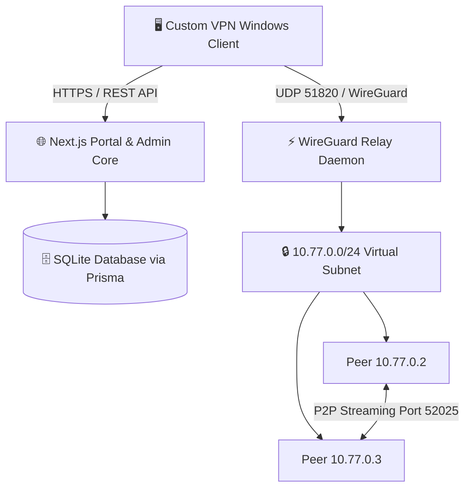

<div align="center">
  <h1>🛡️ PrivateNet / Custom VPN (v0.2.0)</h1>
  <p><strong>A modern, self-hosted peer-to-peer mesh VPN and administration platform built on WireGuard.</strong></p>

  [](LICENSE.md)
  [](https://www.microsoft.com/windows)
  [](https://nextjs.org/)
  [](https://www.wireguard.com/)
</div>

<br/>

*High-performance virtual networking system featuring a native C#/.NET WPF desktop client, a centralized WireGuard relay server, strict 1:1 hardware concurrency locking, and a clean web administration portal with Dark/Bright theme support.*

---

## ✨ Features

- 🛡️ **Zero-Config Desktop Client**: Native WPF (.NET 10) application that installs and manages WireGuard tunnel services, routes virtual IP ranges, and runs elevated background adapters cleanly.
- ⚡ **High-Speed WireGuard Core**: Uses kernel-level WireGuard tunneling running on the `10.77.0.0/24` subnet with bi-directional keepalives for reliable NAT traversal.
- 🔒 **1:1 Device Concurrency Lock**: Strictly enforces single-device session locking per account to prevent credential sharing and duplicate connections.
- 🌐 **Full-Tunnel & Split-Tunneling**: One-click toggling between routing only the internal VPN subnet and routing all system internet traffic (`0.0.0.0/0`) with gateway exception preservation.
- 🎨 **Modern Web Admin Console**: Clean, minimalist administration portal built with Next.js, featuring real-time client monitors, dynamic peer management, and an instant **Dark / Bright Theme Toggle**.
- 📁 **P2P Encrypted File Transfers**: Direct chunked streaming between mesh peers over virtual IPs with SHA-256 hash validation.
- 🗄️ **Lightweight Embedded SQLite**: Zero-maintenance SQLite3 database with Prisma ORM for instant setup without heavy external database services.

---

## 🏗️ System Architecture



---

## 🛠️ Tech Stack

| Component | Technology | Description |
| :--- | :--- | :--- |
| **Desktop Client** | C# / WPF (.NET 10) | Native Windows desktop app with WinTun adapter management |
| **VPN Engine** | WireGuard | Modern, state-of-the-art encrypted UDP tunneling protocol |
| **Web Portal** | Next.js 16 (App Router) | Responsive administration console with dark/light themes |
| **Database** | SQLite + Prisma ORM | Embedded, zero-configuration local database |
| **Process Manager** | PM2 | Background daemon management for production server |

---

## 🚀 Getting Started

### 🖥️ Client Setup (Windows)

1. Run `CustomVPN.exe` as Administrator on Windows 10 or 11.
2. The client automatically downloads and configures the WireGuard engine if not already present.
3. Enter your assigned username and password, then click **Establish VPN Session**.
4. Check **Route All Internet Traffic** to route system internet traffic through the VPN, or leave unchecked for split-tunnel subnet mode.

### 🌐 Server Deployment

1. **Clone the repository:**
   ```bash
   git clone https://github.com/ali38958/Custom-VPN.git
   cd Custom-VPN
   ```

2. **Install dependencies and build the web portal:**
   ```bash
   cd vpn-server
   npm install
   npx prisma db push
   npm run build
   ```

3. **Start with PM2:**
   ```bash
   npx pm2 start npm --name "vpn-server" -- start
   ```

4. **Access the Admin Console:**
   Navigate to `https://your-domain/login` to access the administration dashboard.

---

## 📁 Repository Structure

```text
Custom-VPN/
├── cvpn-client/               # C# WPF Windows Desktop Client
│   ├── MainWindow.xaml        # Client dashboard and status UI
│   ├── VpnService.cs          # REST API authentication & session storage
│   ├── WireGuardTunnelManager.cs # WireGuard service installation and routing
│   └── FileTransferService.cs # P2P TCP chunked transfer engine
├── vpn-server/                # Next.js 16 Web & API Server
│   ├── src/app/admin/         # Modern Admin Overview & Client Controls
│   ├── src/app/login/         # Minimalist Sign-in with Dark/Bright theme
│   ├── src/app/api/client/    # REST API endpoints (login, logout, peers)
│   ├── src/components/        # Reusable UI components & ThemeToggle
│   └── prisma/                # SQLite Prisma schema & seed scripts
├── LICENSE.md                 # Open source MIT License
└── README.md                  # Project documentation
```

---

## 📄 License

This project is open source and available under the [MIT License](LICENSE.md).

---

<div align="center">
  <sub>Maintained by <a href="https://github.com/ali38958">ali38958</a> &bull; Built with ❤️</sub>
</div>
