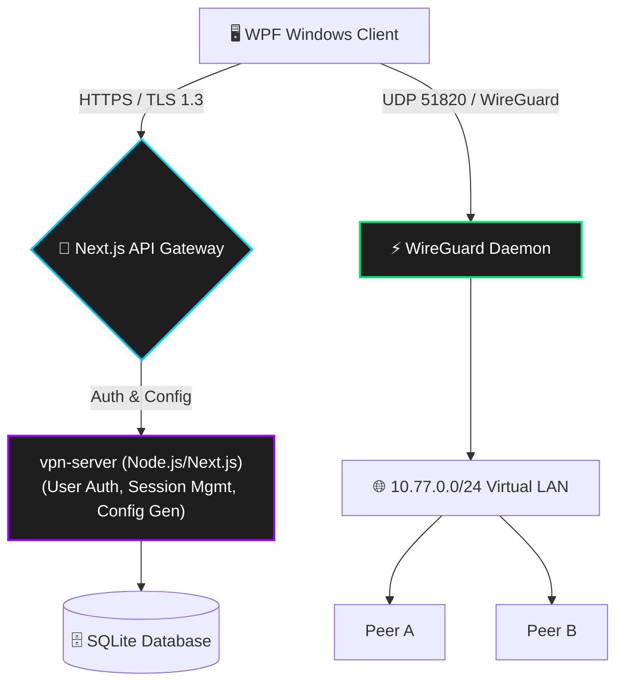

<div align="center">
  
  <h1>🛡️ Custom VPN</h1>
  <p><strong>A secure, self-hosted peer-to-peer mesh VPN built on WireGuard.</strong></p>
</div>

<br/>

*High-performance virtual networking system featuring an intuitive WPF desktop client, a centralized WireGuard relay server, and an intelligent administration portal.*

---

## ✨ Why Custom VPN?

- 🛡️ **Zero-Config Desktop Client**: A single, beautifully crafted WPF `.exe` client that handles tunnel configurations, secure API authentication, and administrative networking privileges automatically on Windows.
- ⚡ **High-Speed WireGuard Core**: Uses the modern, battle-tested, high-performance WireGuard engine running on the `10.77.0.0/24` subnet.
- 🔄 **Dynamic IP Allocation**: Integrated SQLite + Prisma ORM to maintain stateful client sessions and dynamic address allocation without manual configuration conflicts.
- 📈 **Web Administration Portal**: Real-time Node.js/Next.js dashboard to monitor connected peers, enforce access controls, and manage subnet routing without touching a terminal.
- 🔐 **End-to-End Encryption**: State-of-the-art cryptography built directly into the WireGuard protocol for unmatched security and performance.
- 🖼️ **Peer-to-Peer Operations**: Built-in functionality for encrypted file transfers directly between mesh nodes inside the secure virtual LAN.

---

## 🏗️ System Architecture

Custom VPN leverages a robust client-server architecture with secure API gateways and dynamic tunnel orchestration:



---

## 🛠️ Tech Stack

| Layer | Technology | Purpose & Rationale |
| :--- | :--- | :--- |
| **Desktop Client** | C# / WPF (.NET 10) | Native Windows GUI, Administrator elevation, and subprocess management. |
| **VPN Engine** | WireGuard | Industry-standard, highly secure, and blazingly fast tunneling protocol. |
| **Server Backend** | Next.js / Node.js | Modern, high-performance React API framework. |
| **Database ORM** | Prisma + SQLite | Type-safe database queries and state tracking. |
| **Reverse Proxy** | Nginx | SSL termination and HTTP/2 gateway. |
| **Process Manager**| PM2 | Daemonizing and managing the Next.js server instances. |

---

## ⚡ Getting Started

### 🚀 Client Installation

1. **Download the Client**
   Run the generated `CustomVPN.exe` on your Windows 10/11 machine.
2. **Authenticate**
   Enter your provided credentials.
3. **Connect**
   The client will automatically download your secure WireGuard profile and establish a high-speed connection to the mesh network.

### 💻 Server Deployment

1. **Clone the repository**
   ```bash
   git clone https://github.com/ali38958/Custom-VPN.git
   cd Custom-VPN
   ```

2. **Run the Deployment Script**
   Execute the automated bash script to configure WireGuard, Nginx, and Next.js:
   ```bash
   cd vpn-server
   chmod +x deploy.sh
   ./deploy.sh
   ```

3. **Start the API Server**
   ```bash
   npm run build
   npx pm2 start npm --name 'vpn-server' -- start
   ```

---

## 📁 Project Structure

```text
Custom-VPN/
├── cvpn-client/            # C# WPF Windows Desktop Client
│   ├── MainWindow.xaml     # Dynamic UI (Toggle switches, glow effects)
│   ├── VpnService.cs       # API authentication and telemetry
│   └── WireGuardTunnelManager.cs # wireguard.exe orchestration and routing setup
├── vpn-server/             # Next.js Administration and API Server
│   ├── src/app/api/        # REST API for client auth and config delivery
│   ├── prisma/             # SQLite database schemas and migrations
│   └── scripts/            # Deployment and maintenance bash scripts
└── README.md               # You are here
```

---

## 👤 Author & Support

**Muhammad Ali**

- **GitHub Profile**: [@ali38958](https://github.com/ali38958)
- **Project Repository**: [ali38958/Custom-VPN](https://github.com/ali38958/Custom-VPN)

<div align="center">
  <sub>Built with ❤️. ⭐ Star the repository if you find it helpful!</sub>
</div>
