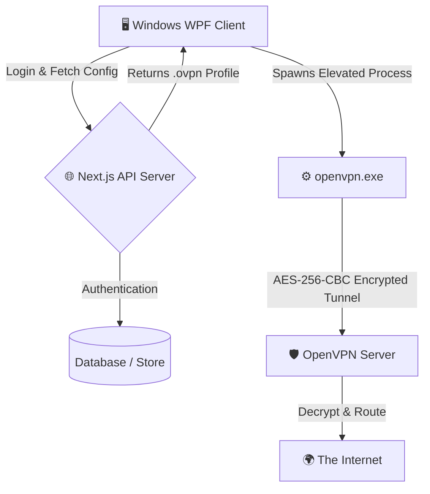

<div align="center">

  # 🛡️ CustomVPN

  **A modern, secure, and automated OpenVPN-based virtual private network client and server stack.**

  [](https://learn.microsoft.com/en-us/dotnet/csharp/)
  [](https://nextjs.org/)
  [](https://openvpn.net/)
  [](#-license)
  [](https://github.com/ali38958)

  [✨ Features](#-why-customvpn) • [🏗️ Architecture](#-system-architecture) • [⚡ Quick Start](#-getting-started) • [📄 License](#-license)

</div>

---

## 📖 The Problem It Solves

Traditional VPN clients often require manual installation of adapters, complex certificate configurations, and tedious command-line setups. On the administrative side, managing peer access and distributing configuration profiles securely can be a logistical nightmare. 

**CustomVPN** solves this by bridging a high-performance OpenVPN core with a sleek, one-click Windows UI (WPF) and a fully automated Next.js API server. It handles everything from silent OpenVPN binary installation and background Windows Service execution to automated profile provisioning—delivering a seamless, consumer-grade VPN experience.

---

## ✨ Why CustomVPN?

- 🛡️ **Automated OpenVPN Provisioning**: The Windows client autonomously detects, downloads, and silently installs the official OpenVPN TAP adapters and binaries if they are missing.
- ⚡ **One-Click Connectivity**: Forget `.ovpn` files. Users simply log in with their credentials, and the client securely fetches and applies their unique profile from the cloud.
- 🔄 **Next.js API Server**: A modern API backend designed to manage user authentication, peer administration, and secure delivery of OpenVPN configurations.
- 🔐 **Secure Execution**: The VPN tunnel runs directly in a hidden, elevated background process, ensuring the client UI remains snappy while handling encryption streams seamlessly.
- 📉 **Split-Tunneling Ready**: Engineered to enforce routing rules effortlessly. Your ISP only sees AES-256-CBC encrypted traffic flowing to the server.

---

## 🏗️ System Architecture

CustomVPN uses a split architecture, combining a lightweight C# client with a scalable Node/Next.js backend:



---

## ⚡ Getting Started

### Prerequisites
- **Client**: Windows 10 or 11, .NET 8.0 SDK or later.
- **Server**: Node.js 18+, Ubuntu (for the OpenVPN host), and Next.js.

### Running the Client
```bash
cd cvpn-client
dotnet build
dotnet run
```
The client will automatically request elevation to manage network adapters and establish the tunnel.

### Running the Server
```bash
cd vpn-server
npm install
npm run dev
```

---

## 📄 License

This project is licensed under the MIT License.
